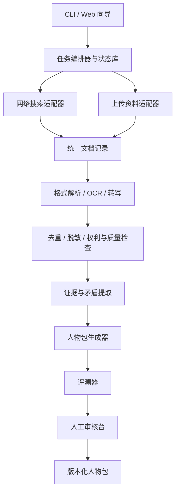

# 开源实现路线

## 推荐架构

每个组件通过稳定数据结构通信。搜索、OCR、转写、LLM 和向量库都做成可替换适配器；核心流程不绑定某一家服务。上传模式应能选择全本地适配器。

## 第一阶段：可工作的本地 CLI

目标不是支持所有格式，而是贯通一个可靠闭环：

- 读取 `job.json` 并通过 JSON Schema 校验；
- 网络模式先支持 URL 清单和少量可配置搜索提供方；
- 上传模式先支持 TXT、Markdown、可提取文本的 PDF 和 DOCX；
- 生成来源台账、`chunks.jsonl`、`evidence.jsonl`、Markdown 审核视图和构建报告；
- 在终端打开身份、隐私异常和发布审核关卡；
- 构建任务可暂停、恢复和增量更新。

此阶段不要先做头像生成、复杂向量数据库或微调。它们不是验证蒸馏质量的必要条件。

## 第二阶段：解析和质量能力

- 加入扫描 PDF OCR、音视频转写、说话人分离和聊天导入器；
- 内容级去重、转载链识别、时间线与矛盾检测；
- 自动生成覆盖矩阵、测试集和差异报告；
- 本地嵌入/模型与远程服务都通过明确配置选择；
- 公开人物包的可复现构建与 CI 校验。

## 第三阶段：Web 向导与审核台

- 拖拽上传、搜索计划预览、任务进度与失败恢复；
- 人物卡编辑器、证据回链和冲突并排比较；
- 私密资料的清晰处理位置提示；
- 一键测试直接对话和定题演讲，再决定是否批准圆桌/故事等更高要求的模拟能力；
- 导入、导出和版本更新，不自动公开。

## 下游运行时封装

人物蒸馏 CLI 与人物使用运行时分开实现。后者接收 `person_id + mode + session`，在后台组合功能契约、人物包、可选功能适配层、会话摘要和临时事实简报；用户不需要看见或粘贴系统提示。直接对话默认只在事实缺口会改变判断时按需联网，搜索结果进入会话级事实简报，不直接写回人物证据或永久索引。详细契约见 [`../直接对话/02-运行时封装与联网策略.md`](../直接对话/02-运行时封装与联网策略.md)。

## 插件接口

开源贡献者最可能扩展的是：`search_provider`、`document_parser`、`ocr_provider`、`transcriber`、`redactor`、`llm_provider`、`embedding_provider` 和 `exporter`。每个插件都应声明：输入/输出版本、是否联网、数据会发送到哪里、许可证、支持语言和失败语义。

## 验收测试

- 两个同名人物不会自动合并；
- 同一访谈的十个转载页只计一个独立来源；
- 损坏文件只导致单文件隔离，任务可以继续；
- 私密上传模式在默认配置下没有网络请求；
- 第三方敏感信息被发现时任务暂停，而不是继续生成；
- 重新构建不覆盖人工修改，撤回来源能列出全部受影响证据；
- 未通过发布审核的人物包不能被标为 `publish-ready`；
- 网络与上传模式生成的人物包均可由直接对话、定题演讲及其他下游读取器加载。

## 建议的首个端到端样例

选择一位资料已进入公有领域或许可清楚的历史人物，用网络模式构建；再用虚构的、明确授权的少量访谈样本测试上传模式。两者都生成 `chat-ready` 人物包后，再开始做 Web UI。这样可以同时验证双入口，又不会一开始就被音视频、复杂隐私和大规模爬取拖住。
