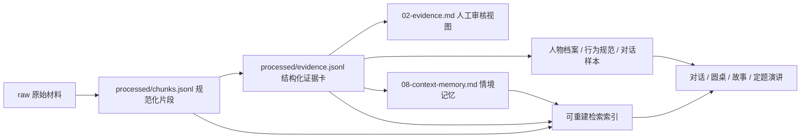

# 蒸馏信息如何存储

`01-sources.csv` 只是来源台账，不是人物记忆本身。真正的信息从原材料进入人物包后，应分成五层保存；任何一层都不能独自冒充完整的“人物蒸馏体”。



## 五层分别保存什么

| 层 | 目录/文件 | 实际内容 | 是否权威数据 |
| --- | --- | --- | --- |
| 原始层 | `raw/` | 用户上传文件、获准保存的网页快照、音视频、OCR 输入 | 是；但默认本地私有，不一定可发布 |
| 规范化层 | `processed/chunks.jsonl` | 清洗后的可定位片段，包括正文或摘要、说话人、时间、页码/时间戳、权利和隐私 | 是；自动提取可追溯性的基础 |
| 证据层 | `processed/evidence.jsonl` 与 `02-evidence.md` | 一卡一主张：证据概述、解释、限制、反例和来源引用 | 是；人物长期记忆的核心 |
| 合成层 | `00-profile.md`、`03-persona-spec.md`、`03-dialogue-examples.md` | 跨卡片形成的人物范围、注意力、行为倾向和原创行为样本 | 是；但每项重要人物判断须能回到证据层 |
| 情境层 | `08-context-memory.md`、`processed/context-memory.jsonl` | 问题发生的环境、可观察动作、失败/张力和可迁移用法 | 是；它比证据卡细，但仍是原创研究摘要而非原文替代品 |

此外可以生成 `processed/index/` 下的 SQLite、全文索引、向量或嵌入缓存。这些只是加速器，随时可以删除并从片段/证据卡重建，绝不能成为唯一保存信息的地方。

## `chunks.jsonl`：保存真正提取出的文本

每行是一个独立 JSON 对象，结构由 [`schemas/normalized-chunk.schema.json`](./schemas/normalized-chunk.schema.json) 约束。核心字段包括：

- `chunk_id` 与 `source_id`：永远能回到来源台账；
- `location`：页码、章节、段落或时间戳；
- `content_mode`：保存的是完整文本、短摘录、摘要还是仅元数据；
- `text`：实际规范化内容，不是文件名；
- `speaker`、`date`、`language`、`topics`：后续按语境选择材料；
- `direct_quote`：是否可当作直接引语；
- `rights_mode`、`privacy_level`：能否进入发布包或远程模型；
- `checksum`：发现来源内容变化和重建差异。

示意记录：

```json
{"schema_version":"1.0","chunk_id":"P-1924-002#C-0007","source_id":"P-1924-002","content_kind":"speech","content_mode":"summary","text":"鲁迅讨论娜拉出走后的现实条件，将经济权视为选择能够持续的关键。","speaker":"鲁迅","date":"1924","language":"zh","location":"经济权讨论段","direct_quote":false,"topics":["女性","经济条件","解放"],"privacy_level":"public","rights_mode":"summary_only","checksum":"<sha256>"}
```

对于版权不允许复制的网页或书籍，`text` 只保存原创摘要或允许的短摘录，`rights_mode` 标为 `summary_only`；原文位置仍登记在台账。私密上传可以在本地保存全文，但须标为 `local_only_text`，不得进入公开包。

## `evidence.jsonl`：保存蒸馏后的判断单元

每行一张证据卡，由 [`schemas/evidence-card.schema.json`](./schemas/evidence-card.schema.json) 约束。它不是原文切片的重复，而是对一个可检查主张的结构化提炼：

```json
{"schema_version":"1.0","evidence_id":"E-0016","card_type":"direct_view","claim":"精神解放离不开经济能力","evidence_summary":"鲁迅讨论娜拉出走后的现实结局，明确强调经济权的重要性。","interpretation":"鼓励离开并不足够，还需检查收入、财产、照护和安全由谁掌握。","limitations":"历史文本不能替代当代女性经验和制度研究。","source_refs":[{"source_id":"P-1924-002","locations":["经济权讨论段"],"chunk_ids":["P-1924-002#C-0007"]}],"topics":["女性","经济条件","解放"],"confidence":"high","status":"reviewed"}
```

自动构建的人物包以 `processed/evidence.jsonl` 为机器规范数据，`02-evidence.md` 是供人审核和 Agent 整体阅读的生成视图。两者使用相同 `E-` ID；人工修改后必须同步重建，不能长期维护两份互相冲突的内容。

手工建立的旧人物包如果还没有 JSONL，则以 `02-evidence.md` 为当前权威证据库。加入 JSONL 时，应在 `06-build-report.md` 记录迁移版本和校验结果。

## 当前人物包的真实状态

| 人物 | 已保存的实际蒸馏信息 | 尚未保存的部分 |
| --- | --- | --- |
| 理查德·费曼 | 40 张审核证据卡；70 条候选情境记忆；57 条 `summary` 片段；结构化证据/情境记忆 JSONL；SQLite FTS5；4096 维离线词汇向量；核心锚点 | 没有批量本地化受版权保护全文；当前向量不是模型语义嵌入；情境记忆仍待运行时盲测 |
| 鲁迅 | 43 张审核证据卡；72 条候选情境记忆；54 条 `summary` 片段；结构化证据/情境记忆 JSONL；SQLite FTS5；4096 维离线词汇向量；核心锚点 | `raw/` 仍无批量作品全文；当前片段是原创证据摘要，不是原文转录；情境记忆仍待运行时盲测 |
| 孔子 | 36 张审核证据卡；42 条候选情境记忆；70 条 `summary` 片段；结构化证据/情境记忆 JSONL；SQLite FTS5；4096 维离线词汇向量；核心锚点 | 《论语》及生平材料具有编纂层次；未批量保存古籍网站全文；头像和运行时盲测尚未完成 |

因此，人物包的 Agent 应把 `03-persona-spec.md`、`03-core-anchors.md`、`03-dialogue-examples.md`、`00-profile.md`、`02-evidence.md`、`08-context-memory.md` 和人物卡作为一组已经消化的记忆读入；不是只读取来源名录，也不是每轮机械检索。需要核验或寻找反例时，才读取 `01-sources.csv`、结构化 JSONL 或 `processed/index/index-manifest.json`。当前 JSONL 是从已经人工审核的 Markdown 卡片迁移而来，`content_mode=summary`、`direct_quote=false`，没有伪装成原始全文。

当前 `vectors.npy` 使用可复现的 `hashed-char-ngram-v1` 词汇向量，适合本地中文/英文关键词相似检索，但 `semantic_embeddings=false`。它完成了索引接口和离线可用性，不等同于大模型 embedding；将来配置嵌入模型后可从相同 JSONL 重建真正的语义索引。

当前迁移与校验工具：

- `scripts/build_structured_memory.py`：从审核后的 `02-evidence.md`、`08-context-memory.md` 和来源台账生成摘要片段、结构化证据/情境记忆、SQLite FTS5 与离线词汇向量。
- `scripts/validate_structured_memory.py`：检查 ID、来源/片段回链、Markdown 对应、索引行数、向量形状和输入输出校验值。

迁移脚本只适合当前这类“已有人工证据卡、没有本地原文”的人物包。未来自动构建应优先从解析后的真实 `raw/` 输入生成片段，而不是先写 Markdown 再反向恢复摘要。

## 为什么不把所有内容只塞进向量数据库

- 向量索引不适合人工审核、版本比较和 Git 差异查看。
- 嵌入模型升级后索引会变化，不能承担长期保存责任。
- 检索只找“相似”，不自动区分直接观点、文学人物、反例和后期修正。
- 权利撤回时，结构化来源引用能准确找到受影响的片段、证据和下游产物。

稳定原则是：**原始材料可追溯，规范化片段可重建，证据卡可审核，人物规范可解释，索引可删除。**

受保护全文、OCR 和长转写进入被 Git 忽略的 `research.local/`，而不是公开 `raw/` 或 `processed/`。本地层、远程 Agent 摘要通道和发布过滤见 [`06-受保护材料处理规范.md`](./06-受保护材料处理规范.md)。

## 发布与隐私

发布人物包时不必发布全部 `raw/` 和 `chunks.jsonl`。构建器根据每条记录的 `rights_mode` 与 `privacy_level` 生成发布清单：

- `publishable_text` 可以按授权进入发布包；
- `summary_only` 只发布原创摘要与来源定位；
- `metadata_only` 只发布台账信息；
- `local_only_text` 永不离开本地，公开包只保留允许的派生结论或完全删除。

撤回一个来源时，先按 `source_id` 找到全部片段，再找到引用这些片段的证据卡，最后使相关人物描述、评测和索引失效并重建。
