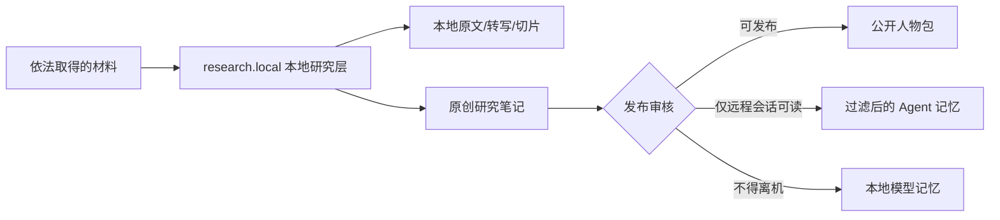

# 受保护材料处理规范

本规范处理仍受著作权、数据库条款、访问合同、隐私或保密义务约束的书籍、访谈、课程、音视频、聊天记录和网页。它是工程准入规则，不是对任何具体材料的法律意见。人物蒸馏的研究价值不能自动覆盖来源权利；“只阅读、不公开原文”会降低部分风险，但不等于取得复制、上传、改编、训练或再发布许可。

## 一、四个问题必须分开判断

对每份材料分别回答：

1. **能否合法访问：** 购买、订阅、图书馆借阅、公开网页或本人授权，只说明取得入口的依据。
2. **能否在本地复制和处理：** 下载、OCR、转写、切片和建立索引都会产生新的副本或处理活动，不能从“能看”直接推出“能批量保存”。
3. **能否交给远程模型：** 把全文或片段发给 API 是一次离开本机的披露；必须同时符合来源条款、保密/隐私义务和模型服务的数据政策。
4. **什么可以发布：** 原文、短引、原创摘要、事实元数据、人物判断和模型参数的发布边界不同。个人研究例外不能自动扩张为开源发布或商业服务许可。

中国《著作权法》第二十四条列有个人学习研究、适当引用等情形，同时要求署名、不得影响作品正常使用、不得不合理损害权利人合法权益；法律同时规定复制、改编、汇编和信息网络传播等权利。面向公众提供生成式人工智能服务时，还应关注《生成式人工智能服务管理暂行办法》关于合法来源、知识产权、个人信息和数据质量的要求。跨境材料与模型服务还要检查适用法和合同，不能把某一法域的“合理使用”当成全球通行证。

权威入口：

- [《中华人民共和国著作权法》](https://www.npc.gov.cn/c2/c30834/202011/t20201119_308796.html)
- [《生成式人工智能服务管理暂行办法》](https://www.cac.gov.cn/2023-07/13/c_1690898327029107.htm)
- [美国版权局《Copyright and Artificial Intelligence, Part 3: Generative AI Training》](https://www.copyright.gov/ai/Copyright-and-Artificial-Intelligence-Part-3-Generative-AI-Training-Report-Pre-Publication-Version.pdf)

## 二、双层人物包



### 公开人物包

Git 中只保存非替代性的成果：来源元数据、少量必要短引、原创摘要、证据卡、核心锚点、情境记忆、对话规范、评测和可重建索引。公开内容不得让读者实质上绕过原作购买或访问，也不得用连续摘要重建原作的章节表达。

### `research.local/` 本地研究增强层

每个人物目录可有一个被 Git 忽略的 `research.local/`：

```text
research.local/
├─ README.md                    # 可提交：边界说明
├─ overlay.example.json        # 可提交：空白契约
├─ overlay.json                # 不提交：本机策略和操作者确认
├─ sources.local.csv           # 不提交：访问依据与权利决策
├─ raw/                        # 不提交：依法保存的原文/音视频/OCR
├─ processed/
│  ├─ chunks.local.jsonl       # 不提交：本地切片或原创摘要
│  └─ evidence.local.jsonl     # 不提交：本地证据卡
└─ index/                      # 不提交：可重建本地索引
```

本地层不是规避版权的隐藏发布包。它只把“研究者依法拥有或能访问、但项目不能再分发”的材料与公开人物包隔离。

## 三、逐源准入记录

`sources.local.csv` 每一行至少记录：

| 字段 | 含义 |
| --- | --- |
| `source_id` | 与公开台账不冲突的稳定 ID |
| `title` / `creator` | 作品和作者/说话人 |
| `access_basis` | 购买、借阅、订阅、公开网页、许可或本人提供 |
| `terms_reference` | 许可、站点条款、馆藏规则或授权记录位置 |
| `local_copy_allowed` | 是否允许在本机保存副本；未知时填 `unknown` |
| `remote_processing` | `none`、`summary_only` 或 `text_allowed` |
| `publish_policy` | `metadata_only`、`summary_only`、`short_quote` 或 `licensed_text` |
| `quote_limit` | 合同或项目自限；不是法定安全数字 |
| `privacy_level` | `public`、`private` 或 `sensitive` |
| `retention` | 保留期限或删除条件 |
| `reviewed_by` / `reviewed_on` | 谁在何时作出决定 |

任何 `unknown` 都按更严格状态处理：不下载、不远程处理、不发布正文。不得绕过付费墙、DRM、访问控制、robots/站点限制或账户权限；不得把图书馆/订阅账号的个人阅读权限变成项目的批量语料授权。

## 四、三条数据通道

| 通道 | 允许内容 | 可用运行时 |
| --- | --- | --- |
| `public` | 已获许可正文、公有领域文本、非替代性原创摘要、元数据 | 开源包、本地模型、远程 API |
| `agent_summary` | 对受保护材料的原创、非连续、不可还原摘要；无敏感信息 | 经审核的远程 Agent/API |
| `local_only` | 合法保存的全文、OCR、转写、长摘录、隐私材料 | 只允许本地工具/本地模型 |

`local_only` 数据不得因为“Agent 能读取工作区”就自动开放给 Codex、Claude Code 或远程 API。Agent 直读时只读公开人物包；只有 `overlay.json` 明确声明当前提供方获准读取 `agent_summary`，才可加载过滤后的本地摘要。原文默认永不读取。

## 五、提取与发布规则

1. 先做章节/场次级定位，再写原创研究笔记；默认不保存连续原文。
2. 短引只用于证明具体分析，标明作者、作品和位置；项目不设置“少于 N 字必然安全”的伪规则。
3. 摘要应跨来源综合、改变表达并保留限制，不能逐段替换同义词或按章节完整复述。
4. 人物声音来自注意力、推理动作、决策案例和对话节奏，不靠复刻受保护作者的长段独特表达。
5. 文学人物、叙述者、受访者转述与本人直接观点必须分开。
6. 发布前运行替代性检查：能否用人物包代替阅读原作、是否保留原作结构、是否出现连续高密度摘录、是否泄露未授权第三方信息。
7. 撤回某一来源时，按 `source_id` 删除其本地切片，重新审核引用它的证据/情境记忆并重建索引。

## 六、人物类型的额外要求

- **已故公共人物：** 仍需逐作品检查保护期、版本、译文、注释、录音录像和数据库权利；“人物已故”不等于全部材料进入公有领域。
- **在世公共人物：** 不把人格模拟宣传成认可、代言或本人机器人；高风险私生活材料不因公开报道而自动纳入。
- **身边的人：** 需要明确、可撤回的同意；聊天中的第三方仍需单独处理。默认本地、禁网、不得公开。
- **鲁迅这类公有领域作者：** 原作保护期届满不代表现代校注、译文、排版、数据库和扫描件没有独立权利；优先记录底本和转录许可。

## 七、发布审核清单

- [ ] 每份来源有访问依据、条款定位和处理决定。
- [ ] 未知权利材料没有进入远程模型或公开包。
- [ ] 公开包不含受保护全文、长摘录或可还原的连续摘要。
- [ ] 远程 Agent 只接收 `public` / `agent_summary` 通道。
- [ ] 人物包提供来源定位，但不提供绕过原站访问的副本。
- [ ] 隐私、保密、肖像、声音和第三方信息已单独审核。
- [ ] 删除/撤回路径能够从来源追到全部下游记忆和索引。
- [ ] 构建报告如实写明哪些材料只做了编目、哪些实际分析过。

本项目的默认决策是：**可以研究，不等于可以复制；可以本地处理，不等于可以发给远程模型；可以生成非替代性理解，不等于可以公开原作。**
