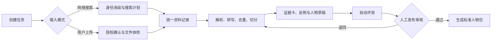

# 人物蒸馏：开放、可审核的自动构建系统

这个子项目负责把来源各异的资料自动整理成统一人物包。它面向两类开源用户：

- 想研究历史人物、思想家或其他公共人物的人，使用**网络搜索模式**；
- 想整理导师、家人、自己或其他身边人物经验的人，使用**用户上传模式**。

两种模式只在资料进入系统的方式上不同。身份确认后，它们都经过相同的解析、来源登记、证据提炼、情境记忆生成、人物规范合成和评测流程，最终写入 `personas/<person-id>/`，供直接对话、圆桌会议、故事推演和定题演讲共同使用。

## “一键”的准确含义

一键不是跳过判断，而是把重复劳动自动化：用户填写一次向导并点击“开始构建”，系统自动运行所有可安全运行的步骤；遇到必须由人负责的事项时暂停，等待确认后从原状态继续。



必须暂停的四个关卡：`身份确认`、`授权/隐私异常`、`严重资料冲突`、`发布审核`。除此之外均可无人值守运行。

## 用户入口

未来 UI 应是一个短向导：

1. 输入人物名称/代号与用途；
2. 选择 `网络搜索` 或 `用户上传`；
3. 确认身份、资料权利和处理位置；
4. 点击“开始构建”；
5. 在审核页查看覆盖度、警告、人物卡和测试对话；
6. 选择“保留为私有草稿”或“发布人物包”。

未来 CLI 可采用以下接口（这是待实现的产品契约，目前不是可运行命令）：

```powershell
persona-distill init --mode web
persona-distill build --config job.json
persona-distill status --job <job-id>
persona-distill review --job <job-id>
persona-distill publish --job <job-id>
```

## 文档导航

- [`01-标准流水线.md`](./01-标准流水线.md)：自动构建状态机、审核关卡和失败恢复。
- [`02-双模式输入.md`](./02-双模式输入.md)：网络搜索与用户上传的详细规则。
- [`03-产物契约.md`](./03-产物契约.md)：所有构建器必须输出的统一人物格式。
- [`04-开源实现路线.md`](./04-开源实现路线.md)：从可用 CLI 到 Web 产品的实施顺序。
- [`05-信息存储模型.md`](./05-信息存储模型.md)：规范化片段、结构化证据卡与可重建索引怎样保存。
- [`06-受保护材料处理规范.md`](./06-受保护材料处理规范.md)：公开人物包、本地研究层、远程模型与发布的权利边界。
- [`07-时代语言与翻译腔规范.md`](./07-时代语言与翻译腔规范.md)：人物如何直接说话，以及古语体、古典译文腔和现代译文腔怎样保持沉浸而不伪造原话。
- [`schemas/distillation-job.schema.json`](./schemas/distillation-job.schema.json)：机器可读的任务配置结构。
- [`examples`](./examples)：两种模式的最小任务配置例子。
- [`scripts/build_structured_memory.py`](./scripts/build_structured_memory.py)：将已审核的手工人物包迁移为 JSONL 与本地检索索引。
- [`scripts/validate_structured_memory.py`](./scripts/validate_structured_memory.py)：验证结构化记忆、回链、向量和索引一致性。
- [`scripts/init_local_research.py`](./scripts/init_local_research.py)：为人物建立被 Git 忽略的本地研究增强层。
- [`scripts/export_agent_overlay.py`](./scripts/export_agent_overlay.py)：只导出经权利和隐私审核的远程 Agent 摘要。

## 开源项目的底线

- 构建过程与最终人物包都应明确标识“人物视角模拟”，不得冒充本人。
- 默认本地优先；上传资料模式默认禁用联网、外部遥测和远程模型。
- 用户提供文件不等于其中所有人都同意被处理或公开。
- 搜索到网页不等于取得全文再发布或训练的权利。
- 自动生成只到“候选人物包”；公开发布始终需要人类审核并留下构建报告。
