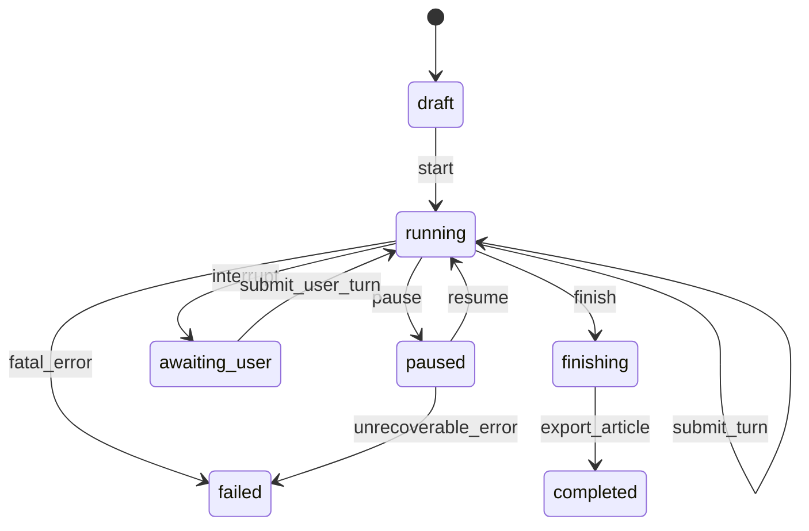

# 会话状态与暂停恢复

## 状态机



状态含义：

| 状态 | 含义 |
| --- | --- |
| `draft` | 配置尚未开始，允许修改参与者和议题 |
| `running` | 可以生成一个人物回合 |
| `paused` | 不生成新内容，等待用户恢复 |
| `awaiting_user` | 已停在用户插话入口，不自动替用户发言 |
| `finishing` | 不再生成人物回合，正在编辑和导出 |
| `completed` | 逐轮记录和最终产物已写入 |
| `failed` | 发生不能自动恢复的错误，保留最后已提交状态 |

## 原子提交

每个生成请求携带：

- `session_id`；
- `state_version`；
- `request_id`；
- `turn_id`；
- 人物包版本和适配层版本。

只有当请求返回时会话仍处于 `running`，且 `state_version` 与请求一致，才允许提交回合。提交顺序必须是：

```text
校验回合
  -> 追加 turns.jsonl
  -> 更新 transcript.md
  -> 更新 claims / provenance 派生记录
  -> state_version + 1
  -> 更新 session.json
```

这些步骤应由运行时使用临时文件和原子替换完成。任何一步失败都不能把会话标成“已提交”。

## 暂停语义

点击暂停时：

1. 将状态从 `running` 改为 `paused`；
2. 递增 `state_version`；
3. 标记在途 `request_id` 为取消或废弃；
4. 立即返回已提交的最后一个回合；
5. 迟到的模型输出因版本不匹配被丢弃，只写入诊断日志，不写入正式转录。

暂停不删除任何已有内容，也不回滚上一回合。

## 继续语义

- `continue_turn` 只消费一个主持决策和一个人物输出。
- `continue_section` 循环直到节末、用户事件或停止条件。
- 恢复前重新读取 `session.json`，不能依赖进程内缓存。
- 如果人物包版本、适配层版本或事实简报版本已经变化，必须拒绝恢复并要求创建新会话或显式迁移。

## 用户插话

插话以独立事件保存：

```json
{
  "event_type": "user_interjection",
  "event_id": "EV-0007",
  "text": "我觉得你们都忽略了学习的经济成本。",
  "created_at": "2026-08-06T12:00:00+08:00"
}
```

它会被注入主持器和下一位人物的上下文，但不会修改任何人物包，也不冒充某个人物的观点。

## 恢复和回放

`transcript.md` 是人类可读视图，`turns.jsonl` 是逐回合机器记录，`session.json` 是当前权威状态。回放应按 `sequence` 重建可见内容，而不是重新调用模型。编辑稿可以重建，但不能反过来覆盖逐轮记录。

## 失败恢复

- 网络或模型超时：保持原状态，允许重试同一请求。
- Schema 失败：最多一次修复重试，仍失败则暂停。
- 文件写入失败：不改变状态版本，报告需要恢复的文件。
- 事实简报失败：暂停当前回合，保留原分歧，不改写成“已核验”。
- 进程退出：从最后一个原子提交点恢复，不重复已存在的 `turn_id`。

