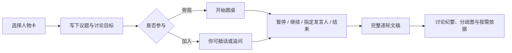

# 圆桌对话：让人物框架彼此碰撞

圆桌不是让模型"演一场历史真人辩论"，而是由多个有边界的人物视角，围绕同一个问题进行一场**可暂停、可继续、可回放、可复核的思想实验**。它应该有张力，但张力必须来自价值、概念、证据和方法的真实差异，而不是凭空吵架。

## 用户体验

最小界面只需有：人物选择卡、议题输入框、`开始`、`暂停`、`继续`、`我想插话`、`结束并生成文稿`。

## 一场讨论的后台运行方式

1. **主持器**读取议题、参与者和讨论目标，给每个人物分配第一轮的切入点。
2. 每个发言回合，只检索该人物与议题相关的材料，同时给它提供前几轮讨论的压缩摘要和它正要回应的具体论点。
3. 人物可以赞同、质疑、追问或修改自己的判断；没有充足材料时须自然承认边界。
4. 主持器控制轮次和发言均衡，避免一个人物垄断、空泛复述或无止境争吵。
5. 用户可完全不参与；点击"继续"才生成下一回合，点击"暂停"则冻结当前状态。用户插话会作为下一轮共同上下文。
6. 结束后保留完整逐轮文稿，并生成一篇编辑后的讨论稿；两者不能混为一份。

## 必须区分的三类内容

| 内容 | 在对话中如何呈现 | 在后台如何记录 |
| --- | --- | --- |
| 直接立场 | 可较坚定地表达，但不伪造逐字名言 | 关联原始证据 |
| 现代情境推演 | 用"若沿用这一思路……"等自然语言 | 标记为 `inference` |
| 与他人交锋的即兴回应 | 可讨论对方论证，不假称历史上真的见过面 | 标记为 `simulation`，保留上下文 |

例如马克思、孔子和爱比克泰德不可能真实同桌，因此最终文稿的页首应写："这是基于各自材料构建的人物视角模拟讨论，不是历史记录或真实发言。"

## 讨论质量规则

- 每轮优先推进一个具体分歧、概念澄清或例子，而不是重复人物标签。
- 先准确复述对方的关键理由，再提出异议；必要时由主持器要求"steelman"（以最强形式理解对方）。
- 当议题涉及现代事实，主持器先提供一份中立的事实简报；人物只讨论其框架可能如何理解这些事实。
- 预设 3--6 轮为一节；每节结束给出"共识、未决分歧、下一问"。
- 设停止条件：达到轮数、问题已收敛、用户暂停，或所有参与者都没有新材料支持的新论点。

## 最终产物

一场圆桌应输出三份不同的东西：

1. **逐轮记录 `transcript.md`：** 谁在何时回应了什么，方便回放。
2. **编辑讨论稿 `essay.md`：** 有标题、背景、论点推进、主要分歧、未决问题；这是可阅读、可分享的成文稿。
3. **研究附录 `provenance.md`：** 按需查看每个关键主张的来源、推演标记与覆盖盲区。

讨论稿可以有文学性，但不应把模拟措辞加进引号后伪装成原话。

## 从最小版本开始

先做 3 位人物、一个议题、固定三轮、纯文本输出。确认它真正呈现了不同的思维方式后，再加自动续聊、头像座位、音效、流式动画和复杂的主持策略。

参与者选择器只加载 `manifest.json` 中达到 `simulation-ready` 或 `publish-ready`，且 `capabilities.roundtable` 为 `true` 的人物。构建者调试草稿时可以显式覆盖，但界面必须持续显示“资料不足的预览版本”。当前第一阶段协议已写入 `01-项目蓝图.md` 至 `08-评测与验收.md`，孔子、庄子和费曼的适配层在 `personas/`，尚未打开人物包能力开关。

## 第一阶段协议导航

- [`01-项目蓝图.md`](./01-项目蓝图.md)：范围、角色、阶段和第一场试验。
- [`02-运行时协议.md`](./02-运行时协议.md)：上下文隔离、发言生命周期、调度和失败处理。
- [`03-主持器规范.md`](./03-主持器规范.md)：如何推进真实分歧而不制造假冲突。
- [`04-人物适配层规范.md`](./04-人物适配层规范.md)：圆桌形式如何与单人直接对话分离。
- [`05-联网与共享事实台.md`](./05-联网与共享事实台.md)：所有人物共享同一事实简报。
- [`06-会话状态与暂停恢复.md`](./06-会话状态与暂停恢复.md)：状态机、原子提交和迟到响应处理。
- [`07-文稿生成规范.md`](./07-文稿生成规范.md)：逐轮记录、编辑讨论稿和研究附录的区别。
- [`08-评测与验收.md`](./08-评测与验收.md)：固定试验、通过条件和失败分级。
- [`09-Agent文本原型使用方法.md`](./09-Agent文本原型使用方法.md)：当前即可用的逐回合 Agent 运行方式。
- [`10-首轮原型报告.md`](./10-首轮原型报告.md)：孔子、庄子、费曼第一场六回合基线及缺口。
- [`schemas`](./schemas)：会话、回合、事实简报、主持决策和文章的机器契约。
- [`prompts`](./prompts)：主持器、人物、事实台和编辑器运行提示。

当前已经完成第一场 Agent 文本基线，但不代表 CLI、Web、并发取消或语音已经实现。三个参与人物仍为私有预览，能力开关未开放。
