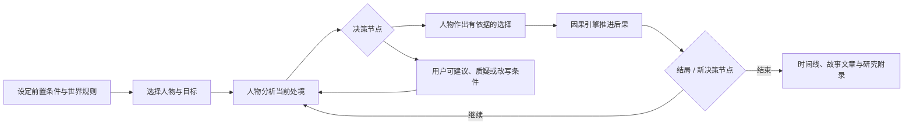

# 故事推演：在选择中观察人物的思想

故事推演让你给出一个**明确前置条件**，再由某一人物视角在连续情境中作出选择，推动事件按合理的因果关系发展。它不是"替历史人物写传记"，而是一种基于其已知方法、价值取向和局限的互动思想实验。

你可以旁观，也可以在关键节点介入。每次选择都会成为可回溯的分支；到达结局时，系统将本次路径整理成一篇完整文章。

## 体验流程

最小界面：人物卡、前置条件输入、`开始推演`、`继续`、`暂停`、`在此介入`、`查看分支`、`结束并写成文章`。

## 四个角色，不能混为一谈

| 角色 | 责任 | 不该做什么 |
| --- | --- | --- |
| 人物视角 | 判断目标、重视什么、会问什么、可能选择什么 | 全知地控制世界或违背其既有材料 |
| 叙事/因果引擎 | 根据世界规则和行动生成合乎逻辑的后果 | 为了剧情方便让事件无因发生 |
| 主持器 | 保持节奏、提示决策点、记录状态 | 替人物强行决定或预设结局 |
| 用户 | 旁观、插话、添加条件、在许可时改写分支 | 把改写后的历史当真实事实 |

## 输入应该足够具体

不要只写"让孔子穿越到现代会怎样"。更适合的开始方式是：

> 2026 年，一所资源有限的中学发生严重的同学排挤。校长邀请孔子视角担任一个月的教育顾问；他不能使用超出材料覆盖范围的现代专业知识，只能向教师、学生和家长提问并提出建议。目标不是迅速给出惩罚，而是让班级恢复可持续的互信。

这个设定交代了时间、地点、角色权限、信息边界和成功标准，因果推演才有抓手。

## 每个决策节点的生成协议

1. 叙事引擎先描述新事实及其原因，不替人物下结论。
2. 人物视角说明自己注意到的冲突，提出必要追问。
3. 给出 2--4 个**其材料可能支持**的行动方向；若人物主动选择，也说清选择理由。
4. 将选择写入状态：目标、资源、关系、风险、未解问题和依据。
5. 因果引擎只根据前置条件、既有状态与选择推进可预见后果，同时保留偶然性和不确定性。
6. 用户点击继续、插话、暂停或在明确标记的节点改变条件。

前台以自然叙事呈现；后台将该回合标为 `direct`（有直接材料）、`inference`（框架推演）或 `simulation`（虚构事件回应）。

## 结局后的三份输出

1. **`timeline.md`：** 所有状态变化与因果链，便于回看或从节点重开分支。
2. **`story.md`：** 沿本次实际选择路径写成一篇完整的故事文章。文章开头说明它是人物视角模拟，不把模拟台词放进引号伪装原话。
3. **`provenance.md`：** 关键选择对应的材料、推演程度、反例和人物资料盲区；默认隐藏，按需查看。

## 质量规则

- 人物不等于万能主角：他/她会受权限、信息、资源、其他人的自主性和错误判断限制。
- 因果不是单线胜利：每个决定都要有成本、延迟效应、他人反应或未预见后果。
- 不让思想标签替代人物：不能把某人每次都写成重复同一句理论口号。
- 历史人物不会自动拥有现代事实和工具；现代背景知识须由前置条件或中立事实简报显式提供。
- 结局不是评价人物"对/错"的唯一标准，要保留可比较的替代分支与未决张力。

## 最小版本

先做一个人物、一条主线、3 个决策节点和一个结局。每个节点都先保存状态，再由用户点击继续。确认选择—后果链有说服力后，再加入分支树、可视化时间线、多人物共同决策和不同结局的比较。

人物选择器只加载 `manifest.json` 中达到 `simulation-ready` 或 `publish-ready`，且 `capabilities.story_simulation` 为 `true` 的人物。故事比普通聊天需要更多真实决策案例和反例，因此不能只凭人物卡或语言风格开启该能力。
